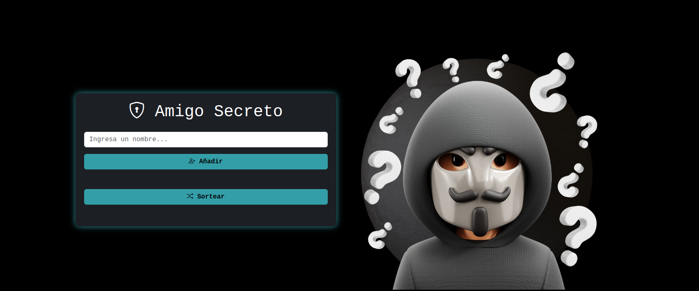

# Amigo Secreto - Hacker Edition


<p align="left">
   
</p>

_Desarrollo de una aplicación con temática hacker que permite a los usuarios ingresar nombres de amigos en una lista y realizar un sorteo aleatorio para determinar quién es el "amigo secreto"._

---
## 🚀 Comenzando

Sigue estas instrucciones para obtener una copia del proyecto y ejecutarlo en tu entorno local para propósitos de desarrollo y pruebas.

### 🔧 Instalación

```sh
git clone 
```

Una vez clonado el repositorio, abre el archivo `index.html` en tu navegador preferido.

---

## ⚙️ Funcionalidades del proyecto

- `Agregar nombres`: Los usuarios pueden escribir un nombre en el campo de entrada y agregarlo a la lista.
- `Validar entrada`: Si el campo está vacío o el nombre ya existe, el sistema muestra una alerta con SweetAlert2.
- `Visualizar la lista`: Los nombres ingresados aparecen en una lista visible debajo del campo de entrada.
- `Sorteo aleatorio`: Se selecciona un amigo secreto aleatoriamente y se muestra en un mensaje de alerta.

---

## 📦 Capturas de pantalla

  
  

---

## 🛠️ Tecnologías Utilizadas

- HTML5
- CSS3 (con Bootstrap 5)
- JavaScript (SweetAlert2 para validaciones y alertas interactivas)

---

## ✒️ Autor

* **Yuliana Zamora** - *Desarrolladora Web* - [GitHub](https://github.com/Yzamora25)

---

## 📜 Licencia  
Este proyecto está bajo la licencia MIT - consulta el archivo [LICENSE](LICENSE) para más detalles.

---

## 🎁 Expresiones de Gratitud

* Comparte este proyecto con otros 📢
* Si te gusta, dale una estrella en GitHub ⭐
* ¡Gracias por tu apoyo! 😊

